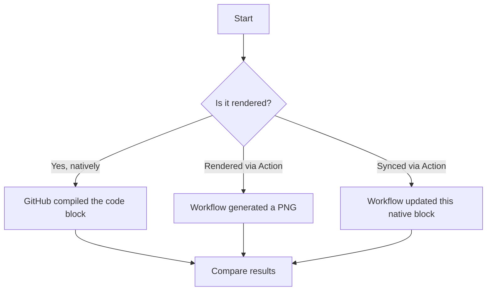
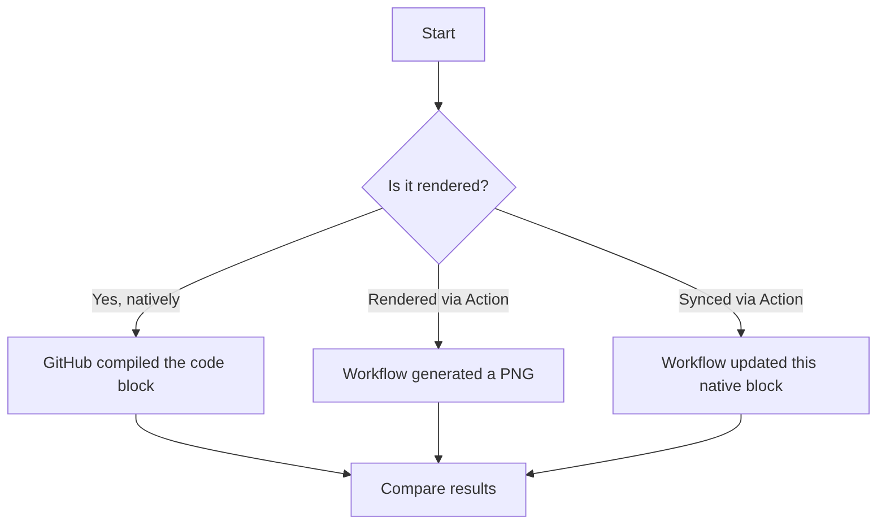

# Mermaid Rendering Test — 3 Approaches

This repo compares three ways of getting a Mermaid diagram into a GitHub README.
All three diagrams below show the same flowchart so the rendering can be compared directly.

| # | Approach | Source of truth | Automation |
|---|---|---|---|
| 1 | Native block, written by hand | the README itself | none — you edit the fence directly |
| 2 | Action renders a PNG | [`diagrams/flow.mmd`](diagrams/flow.mmd) | `.github/workflows/render-mermaid.yml` |
| 3 | Action syncs a native block | [`diagrams/flow.mmd`](diagrams/flow.mmd) | `.github/workflows/sync-mermaid.yml` |

---

## Test 1: Native block, hand-written

The Mermaid source lives directly in this README inside a plain ```` ```mermaid ```` fence.
GitHub renders it natively. To change this diagram, edit the fence below by hand —
nothing regenerates it.



## Test 2: Action-rendered PNG

Source: [`diagrams/flow.mmd`](diagrams/flow.mmd). On every push that touches `diagrams/*.mmd`,
[`render-mermaid.yml`](.github/workflows/render-mermaid.yml) uses
[`mermaid-cli`](https://github.com/mermaid-js/mermaid-cli) (headless Chrome) to compile the
diagram to `diagrams/rendered/flow.png`, commits it, and the image below just points at that file.

<!-- Generated by .github/workflows/render-mermaid.yml — won't exist until it has run once -->


## Test 3: Action-synced native block

Same source file, [`diagrams/flow.mmd`](diagrams/flow.mmd), but instead of rendering an image,
[`sync-mermaid.yml`](.github/workflows/sync-mermaid.yml) runs
[`scripts/sync_mermaid.py`](scripts/sync_mermaid.py) to copy the current `.mmd` contents into
the native ```` ```mermaid ```` block below, between the markers. GitHub still renders it
natively — you just never touch this block by hand.

<!-- MERMAID:flow:START -->

<!-- MERMAID:flow:END -->

---

## Comparison

| | Test 1 (manual native) | Test 2 (Action PNG) | Test 3 (Action-synced native) |
|---|---|---|---|
| Renders natively on GitHub | ✅ | ❌ it's an image | ✅ |
| Renders on non-GitHub Markdown viewers | ❌ shows raw code | ✅ it's just an image | ❌ shows raw code |
| Theme-aware (dark/light mode) | ✅ | ❌ fixed at render time | ✅ |
| Single source of truth | ❌ README is the only copy | ✅ `.mmd` file | ✅ `.mmd` file |
| Editable without touching README | ❌ | ✅ | ✅ |
| Diff-friendly | ✅ text diff | ❌ binary PNG diff | ✅ text diff |
| CI dependency | none | headless Chrome via `mermaid-cli` | plain Python, no browser |
| Fails safely on bad Mermaid syntax | GitHub shows "Unable to render" | workflow run fails, old PNG stays | GitHub shows "Unable to render" after sync |

**Takeaway:** if you want diagrams that look native and stay in sync with a single edited
file, Test 3 gives you that without the overhead of headless-Chrome rendering. Test 2 is
still useful if you need diagrams to show up somewhere that doesn't render Mermaid natively
(e.g. PyPI/npm readmes, some wikis, Slack previews, etc.), since a PNG works anywhere.

## Repo layout

```
.
├── README.md
├── diagrams/
│   ├── flow.mmd                # single Mermaid source, feeds Test 2 and Test 3
│   ├── puppeteer-config.json   # needed for mermaid-cli's headless Chrome (Test 2 only)
│   └── rendered/
│       └── flow.png            # generated by render-mermaid.yml (Test 2), do not edit by hand
├── scripts/
│   └── sync_mermaid.py         # copies flow.mmd into README's marker block (Test 3)
└── .github/
    └── workflows/
        ├── render-mermaid.yml  # Test 2: .mmd -> PNG via mermaid-cli
        └── sync-mermaid.yml    # Test 3: .mmd -> native block via sync_mermaid.py
```
